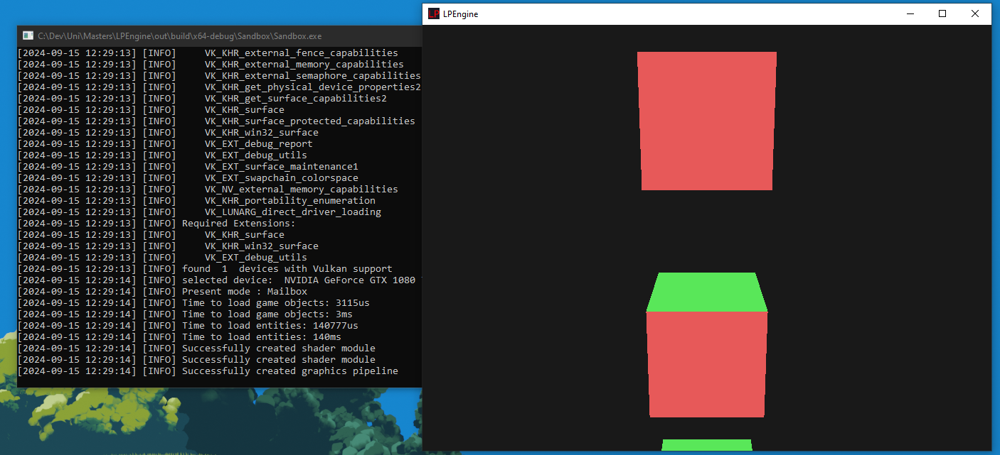

# LPEngine - Lincoln Project Engine

A game engine created for my masters project at the University of Lincoln.
The engine will make use of a Vulkan renderer, and will be written in C++.
The purpose of this project is to analyze and compare the performance of Entity Component Systems (ECS)
and alternative design patterns for game engines.

